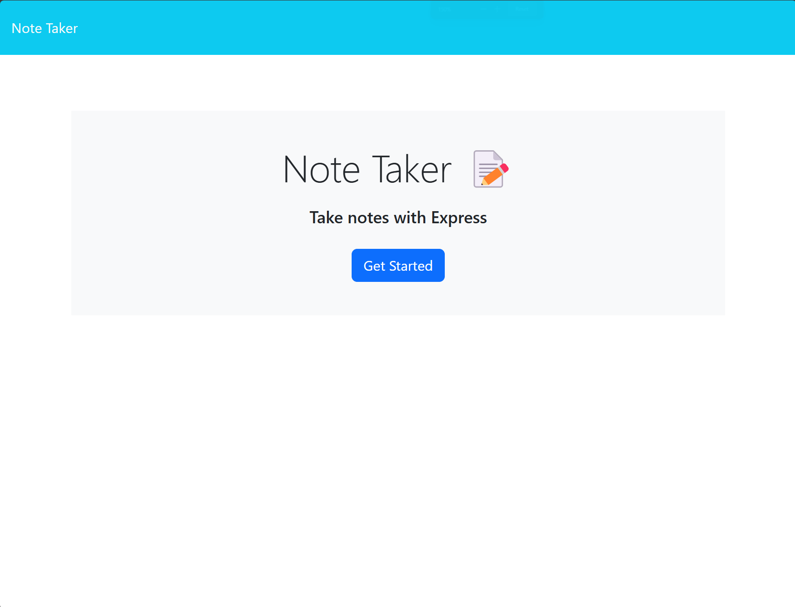
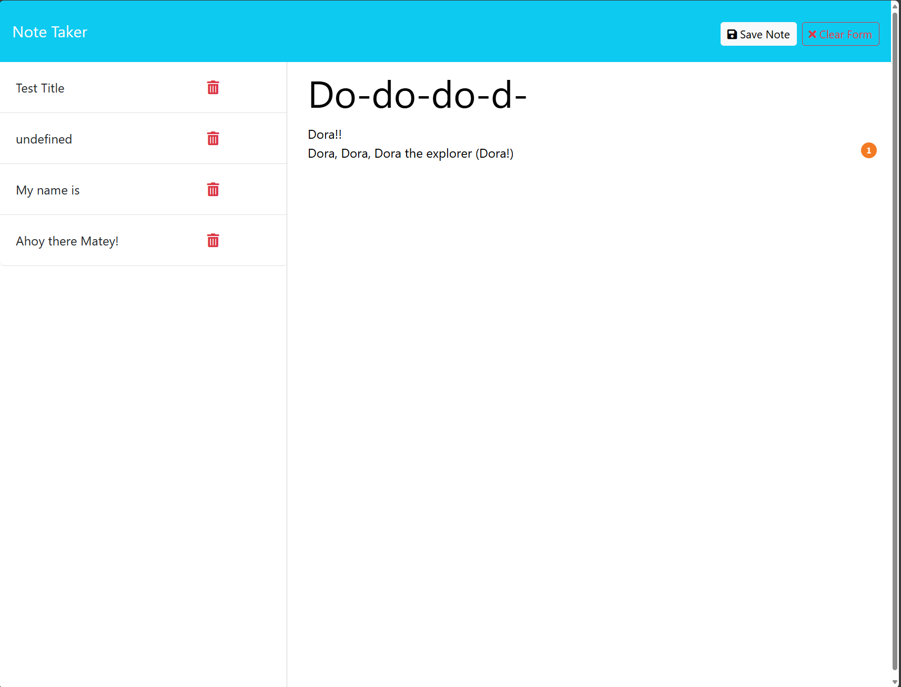

# Note Taker

## Description
The idea behind this project was to create API and HTML routes for the server in the back end. The focus of this project was mainly in the back end so starter code was used to for the front end. The purpose of this project was get more familiar with set up and creating routes for servers. I was able to get a better grasp of routes and the creating servers by working on this project.

## Usage
This project can be used for taking simple notes. To use this note taker you can follow the link to be able to use the note take and can be used to take note for any purpose. Here is the link for the deployed site https://note-taker-dzz5.onrender.com/. It will take you to the launch page where you will click on get started to get the notes pages. Then from there you can see the saved notes previously and add a new note by typing or clicking on a note and the button of create new note in the upper right corner. Unfortunately, the delete button was not implemented for this project so it will not work.
 

## Credits
- Starter Code from Xander Rapstine https://github.com/coding-boot-camp/miniature-eureka
- For the UUID from npm https://www.npmjs.com/package/uuid
- NodeJS FS https://nodejs.org/dist/latest-v6.x/docs/api/fs.html

